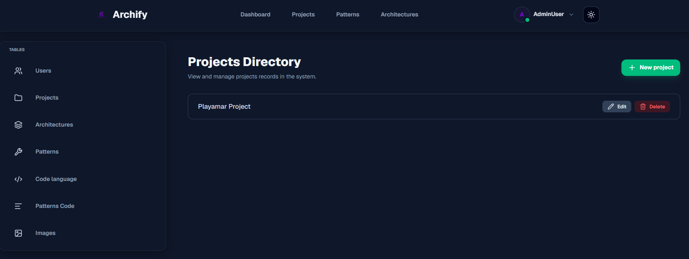
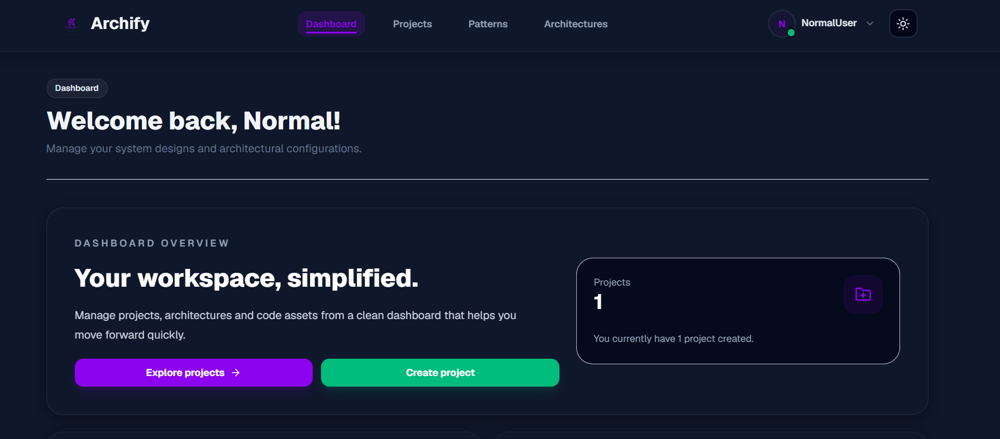
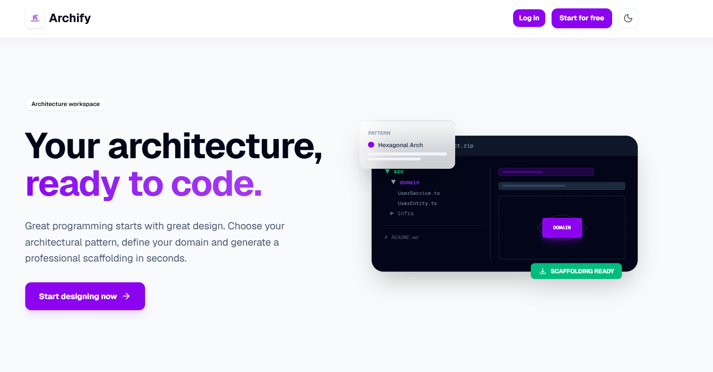
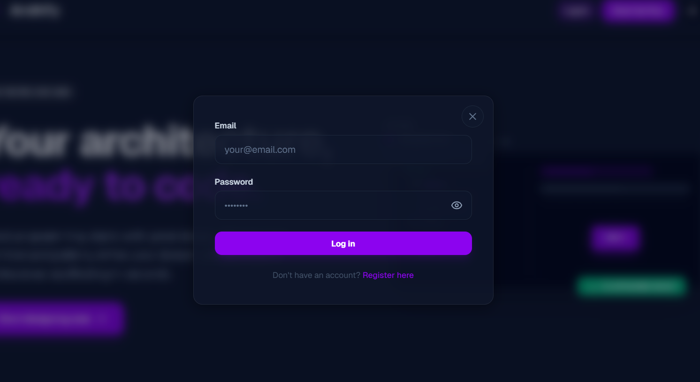
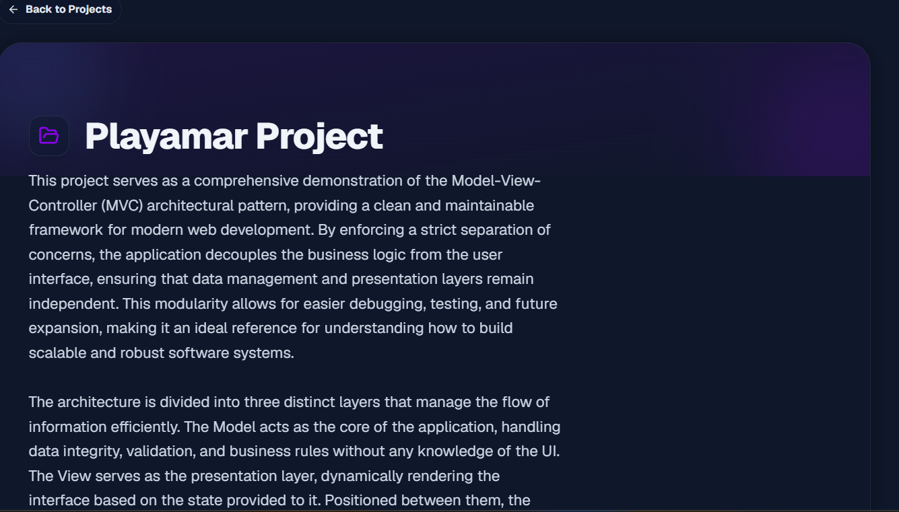
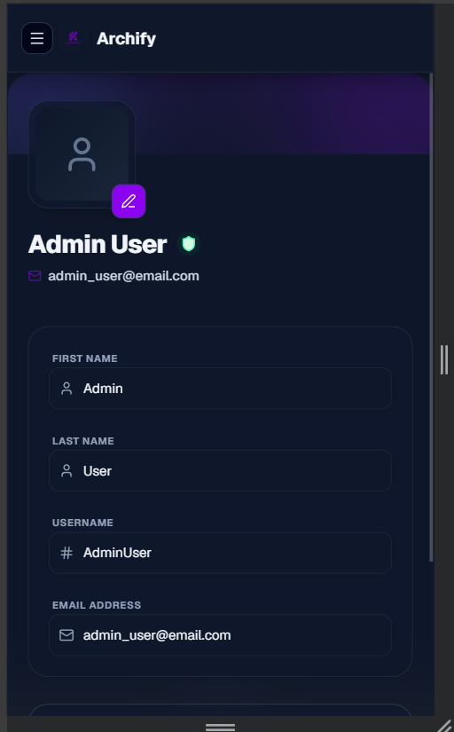

# Archify

[](https://www.python.org/)
[](https://fastapi.tiangolo.com/)
[](https://nextjs.org/)
[](https://react.dev/)
[](https://www.typescriptlang.org/)
[](https://supabase.com/)
[](https://tailwindcss.com/)

Archify is a mono-repo for a software architecture design platform. It contains two connected subprojects:

- `archify-backend`: REST API and domain logic in Python.
- `archify-frontend`: Interactive web UI in Next.js.

## What does Archify do?

Archify helps architects and developers:

- create and store software architecture projects.
- design component diagrams, nodes, and relationships.
- manage design patterns and programming languages.
- upload images and assets via Supabase Storage.
- export architecture projects as downloadable code packages.

## Visual stack

| Layer | Technology | Purpose |
|---|---|---|
| Frontend | `Next.js`, `React`, `TypeScript` | Interactive UI, diagram editor, auth, API consumption |
| Graphing | `AntV X6` | Node-based diagram editor and canvas rendering |
| Backend | `FastAPI`, `Python`, `Pydantic` | REST API, request validation, business rules |
| Architecture | Hexagonal Architecture | Clear separation between API, domain and infrastructure |
| Backend services | `Supabase` | PostgreSQL, Auth, Storage, data persistence |

## Repo structure

```text
archify/
├── archify-backend/   # Python API and hexagonal domain
├── archify-frontend/  # Next.js web interface
└── README.md          # Root documentation
```

## Screenshots

The following screenshots show UI pages and dashboard views included in the `public/` folder.

| Screenshot | Preview |
|---|---|
| `Admin.png` |  |
| `dashboard.png` |  |
| `Light.png` |  |
| `login.png` |  |
| `project.png` |  |
| `Responsive.png` |  |

## Submodules

### `archify-backend`

Python backend exposing business logic via REST endpoints. It follows Hexagonal Architecture with clear separation between:

- API layer (`app/api`)
- Domain layer (`app/domain`)
- Infrastructure adapters (`app/infrastructure`)

Read more in [archify-backend/README.md](archify-backend/README.md).

### `archify-frontend`

Frontend built with Next.js and Tailwind CSS. It provides an interactive diagramming experience using AntV X6.

Read more in [archify-frontend/README.md](archify-frontend/README.md).

## Run the project

### Backend

1. Change directory to `archify-backend`
2. Ensure Python 3.13+
3. Install dependencies with `uv sync`
4. Set Supabase environment variables
5. Start the server:

```bash
uvicorn app.main:app --reload
```

### Frontend

1. Change directory to `archify-frontend`
2. Install dependencies:

```bash
npm install
```

3. Start the local development server:

```bash
npm run dev
```

4. Open `http://localhost:3000`

## Requirements

- Node.js (LTS recommended)
- Python 3.13+
- Supabase project with Auth, PostgreSQL, and Storage configured

## More info

- `archify-backend/README.md`: Backend documentation.
- `archify-frontend/README.md`: Frontend documentation.
